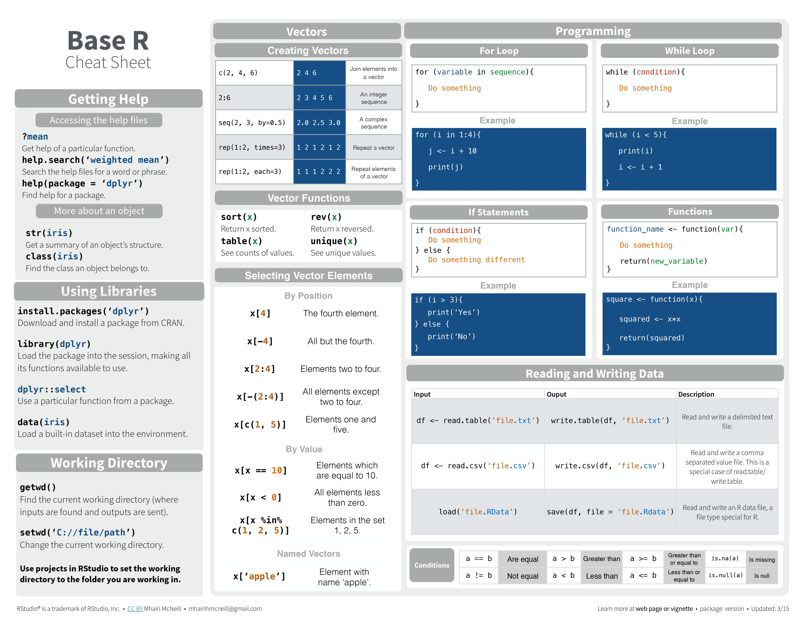
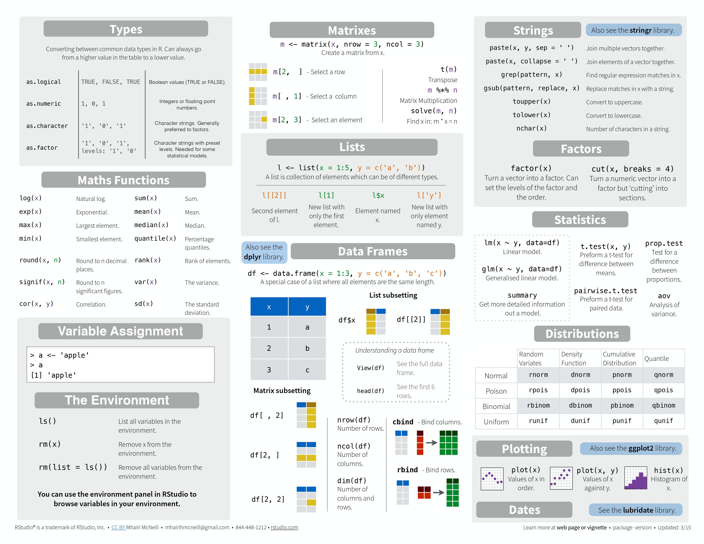

```{r setup, include=FALSE}
#library(this is where you want to load your packages e.g. tidyverse)
knitr::opts_chunk$set(echo = TRUE)
```

## R Markdown
For more details on using R Markdown see <http://rmarkdown.rstudio.com>.

#```{r}
#this will run the code and show it in the Rmarkdown file
```

#```{r, echo = FALSE}
#this will run the code but NOT show it in the Rmarkdown file
```

#```{r, eval = FALSE}
#the code won't be run but will show it in the Rmarkdown file
```

<center>

</center>
<center>

</center>
<center>

</center>
